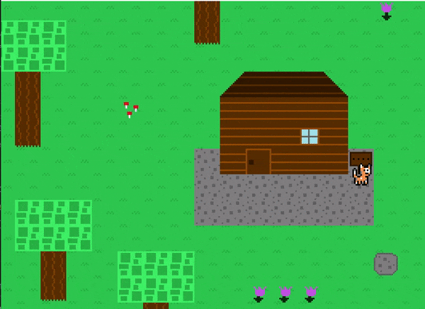
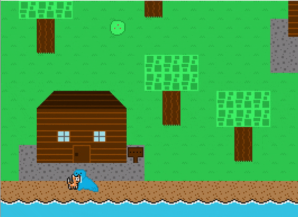
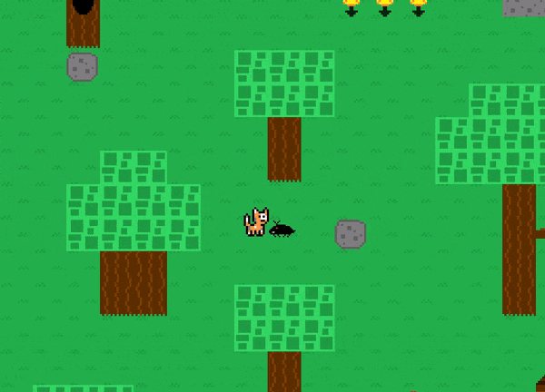

## Table of contents
{: .no_toc .text-delta }

1. TOC
{:toc}

---

# Script Overview

# What is a script?

A script (represented by the `Script` class in the `Level` package) is an abstract class that allows for an "event" to be constructed and later triggered and executed by the game as many times as desired.
If you are familiar with Java Swing components, you can think of a script like how you would code a `JButton's` click event.
The idea is that a script contains code that should be executed at a later time, but the code needs to be defined up front in order for the game to use it.

The game's scripting engine handles executing a script when it has been triggered, whether that is through interacting with an NPC, the player walking on a specific spot on the map, etc.
From there, it's the script's job to tell the game what to do next through a set of instructions, which can include things like displaying text in the textbox, moving an NPC, and anything else that is desired.

Each script is made up of an instruction set, with each instruction acting as a "buliding block".
A script will start at its first instruction and work its way to the last instruction before terminating.
Each instruction is known as a script action.
It is highly recommended to understand both the scripting engine over page [here](./scripting-engine-overview.md) and the script actions page [here](./script-actions.md) before continuing on with this page.
This is the most complicated area of the game engine and has a bit of a learning curve, but put some time into getting the hang of things and you will be an expert in no time!

## Execution

The game engine will handle script execution when it comes to interact scripts and trigger scripts associated with map entities.
The engine will pick up on when the time has come for a script to be executed (such as interacting with an NPC that has an `interactScript`), and will
include the script's execution in the update cycle until it has completed. The current script being executed is considered the "active script".

Note that scripts do NOT "pause" the rest of the game.
This was done intentionally to allow for things like animated tiles to not freeze in place and other background processes to still be run that are unrelated to the current script event. While this did make things a bit more complicated to implement,
the end result lends to a much better made game engine that improves the player's immersion.
All scripts will typically use the "lock player" script action to prevent the player from moving or interacting with something else until the currently active script has finished executing.

## Script State

While a script is active, there are two states it can be in: `RUNNING` and `COMPLETED`. These are defined in the `ScriptState` enum in the `Level` package.
Essentially, it gives each script full control over telling the game when it has finished executing. 
The game will continuously call a script's update cycle while it is active, and as a result the script will continuously respond telling the game whether it is either still running (sending back a `ScriptState.RUNNING` response) or that it has finished (sending back a `ScriptState.COMPLETED` response).
As long as a script eventually returns a `COMPLETED` response, the game will handle deactivating the script and returning the game to its normal state.

## How to create a script

The `Script` class is abstract, meaning it must be subclassed. 
Currently, the game has several `Script` subclasses located in the `Scripts.TestMap` package. The reason all scripts aren't just thrown into the generic `Scripts` package is that scripts tend to be separated out by map, and while there is only one map `TestMap` in this game currently, I wanted to make it easier for
other developers to organize their scripts for the future. As a result, all scripts that are used in the `TestMap` map belong in the `Scripts.TestMap` package.

There is one `Script` subclass, however, that IS inside the generic `Scripts` package: `SimpleTextScript`.
This script's only instructions are to loads up a textbox, show text, and then close the textbox.
I decided that this script is simple and generic enough that it could be used in many different maps. 
It is up to the developer to choose if a script belongs to a map, or is generic and reusable enough to be used across multiple maps.

More on what these `Script` subclasses actually do is gone into detail later on this page.

To create a new script, make a new class and extend from `Script`. I recommend using the `SimpleTextScript` class as a base template. The constructor of a script subclass will typically be empty, but in cases like `SimpleTextScript` it may require external information, which can easily be defined when necessary.

Additionally, each script subclass must override the `loadScriptActions` method, which is where the script's instruction set is loaded from. The method signature looks like this:

```java
@Override
public ArrayList<ScriptAction> loadScriptActions() {
    ArrayList<ScriptAction> scriptActions = new ArrayList<>();

    // ... load instructions here

    return scriptActions;
}
```

## How to attach a script to a map entity

Scripts can be attached to any [NPC](./npcs.md), [MapTile](./map-tiles-and-tilesets.md), or [EnhancedMapTile](./enhanced-map-tiles.md) class instance as an "interact script".
This means the script will become active and execute when the player interacts with the entity.
A map subclass handles attaching scripts to its entities. 
For example, in the `TestMap` map subclass in its `loadNPCs` method, it creates the `Walrus` NPC and then calls its `setInteractScript` method to assign it an interact script.
The interact script it assigns to this NPC is the `WalrusScript` class, which is a script subclass found in the `Scripts.TestMap` package.

```java
Walrus walrus = new Walrus(1, getMapTile(4, 28).getLocation().subtractY(40));

// walrus's interact script is set here
walrus.setInteractScript(new WalrusScript());

npcs.add(walrus);
```

Scripts can also be attached to any [Trigger](./triggers.md) class instance as a "trigger script". 
This means that the script will become active when the player activates the trigger by walking on top of it. Triggers have a `setTriggerScript` method that can be used, but typically the script is just passed into its constructor.

```java
triggers.add(new Trigger(790, 1030, 100, 10, new LostBallScript(), "hasLostBall"));
```

## Script Actions

A script can have any number of script actions in its instruction set.

The `ScriptAction` class represents an instruction in a script.
The `ScriptActions` package contains many different reusable script action subclasses that can be used in any script.
Some examples of script actions include showing text in the textbox, moving an NPC around the map, etc.

Each `ScriptAction` subclass can define the following three methods:
- `setup` -- logic that gets run before event execution, this method is only called one time
- `execute` -- logic that gets run during event execution; this is the actual "event" being carried out.
- `cleanup` -- logic that gets run after event execution, this method is only called one time

Each of the script action subclasses currently included in this game engine are explained [here](./script-actions.md).
This page also covers how to create a new script action if necessary.

## Creating a new script

Once you have a script subclass, you are free to have it perform...well any event logic you want. 
It's extremely customizable, as any script event is capable of doing anything it wants to the game through the use of script actions (both pre-existing and new ones that a developer can create), such as bringing up a textbox, moving NPCs, changing map tiles, etc.

Scripts are made up of any number of `ScriptAction` class instances, which represents an instruction telling the script what to do when it reaches that particular segment.

The best way to understand how the scripts all work is by looking at the existing scripts in the game.
Each of the scripts currently used in the game are explained [here](./script-details.md).
Each of the script actions currently included in the game engine are explained [here](./script-actions.md)

Understanding and creating scripts can be a bit difficult at first due to their more complex nature compared to the rest of the game engine, but they're one of those things where once it all "clicks", they becomes pretty trivial to work with.

## Resources

When working with scripts, the following resources are provided to support more complex logic states and functionalities.
The below subsections cover some of the most commonly used resources available to scripts.

### Flags

A flag is just a boolean variable representing that something has "happened" in the game. 
If a flag is "set", it means that it is `true`. If a flag is "not set" (or "unset"), it means that it is `false`.
A collection of flags represents the "state" the game is currently.
Scripts often utilize flags in order to both selectively run code based on the current game state, and tell the game that something has "happened".
Flags allow for things like changing what an NPC says when talked to based on where the player is in the game's story.

There is a class called `FlagManager` that handles managing the current game state and the setting/unsetting of flags.
The `FlagManager` instance is created in the `PlayLevelScreen` class. Currently, four flags are added to it.

```java
// setup state
flagManager = new FlagManager();
flagManager.addFlag("hasLostBall", false);
flagManager.addFlag("hasTalkedToWalrus", false);
flagManager.addFlag("hasTalkedToDinosaur", false);
flagManager.addFlag("hasFoundBall", false);
```

As you can see, each flag is given a descriptive enough name in order to figure out what it represents.
For example, the `hasTalkedToWalrus` flag represents whether the player has already talked to the walrus NPC or not.

An example of utilizing flags in a Script can be seen in the `WalrusScript` class, which is in the `Scripts.TestMap` package.
Using a flag in this script correctly allows for the walrus NPC to say different messages to the player based on whether is is the first time the player has spoken to the walrus or not.
More on how the `WalrusScript` class works and how it uses this flag for conditionally script behavior can be found [here](./scripts#walrus_script)

Any number of flags can be defined in the `FlagManager` class instance and then used within any script.
The flags MUST already be defined first though (which happens when the `PlayLevelScreen` class creates the `FlagManager` class instance) prior to scripts being able to set/unset them. 

### Textbox

A staple to RPG games, this game utilizes a textbox that display text to the player. 
This immersion and communication technique allows for the player of the game to "speak" to NPCs, "interact" with entities, etc.
An example of this can be seen in the scripts for the sign map tiles:



The textbox is a resource that can be called to be shown at any time in a script using the `TextboxScriptAction` class. 
It can then be given any number of lines of text to display.
The player can keep triggering new lines of text to be shown until there is no more text left. 
Once it has run out of text to show, the textbox will hide itself.

The `Textbox` class can be found in the `Level` class and it handles all the textbox logic.
Once it is called to be shown on screen, it becomes "active". 
The map will recognize this and then include the textbox in its update cycle. 

You can see an example of the textbox handling many different text "segments" and the player proceeding through them when speaking with the walrus NPC:



Additionally, if you compare the sign textbox script and the walrus talking script, you'll notice that the textbox is displayed on the bottom of the screen for the sign script and at the top of the screen for the walrus script.
The textbox will by default always display on the bottom of the screen unless the camera has hit the end bounds of the map.
If the camera hits the south end bounds of the map, there is a possibility that the player or other entities being talked to could end up being covered by the textbox, since the player isn't guaranteed to be in at least the center of the screen on the y axis. 
To circumvent this potential issue, the textbox will change to display on the top of the screen if the camera is at the south end bounds of the map.

The `Textbox` class cannot automatically detect that the given text will fit in its box, so it may take some trial and error to get text to fit right.
Since the textbox has enough room for two lines of text, you can put a newline character `\n` in a text item to have it drop to the next line.
Technically you can have as many newline characters as you'd like, but any more than one will cause the text to overflow the box vertically.

#### Textbox Options

The textbox class also supports the ability to show a list of two options to the player and allow them to choose one.
Upon choosing an option, the script that triggered the options textbox will receive the user's selection, which allows for on-the-spot dynamic script decision making.
You can see this functionality when speaking with the bug NPC:



More on how the `BugScript` class works and how it sets up this options select can be found [here](./scripts#bug_script)

### Common References

All scripts and their script actions are provided references to the `map` and `player` class instances.
This allows each script to perform actions on those classes, call their methods, etc.

Interact scripts are also provided a reference to the entity they are attached to in the `entity` variable.
While any entity can be manipulated in any script using the `getNPCById` base `Script` method, this `entity` reference just makes things more convenient, as it's common to need to perform actions on the current entity being interacted with (such as forcing the interacted with NPC to face the player).

The `entity` reference uses a generic type, meaning in order to use it, a type must be explicitly stated in the creation of the script subclass.

Most of the usages of these refrences are abstracted away in the script actions, but once in a while having direct access to them in the script subclass is also necessary.

// TODO: scriptoutputmanager???