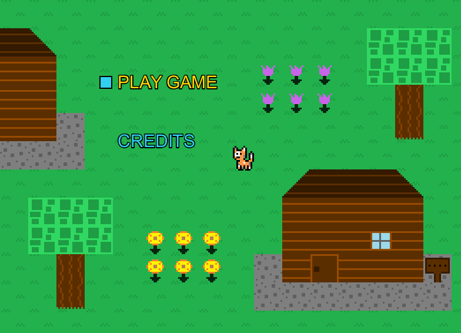
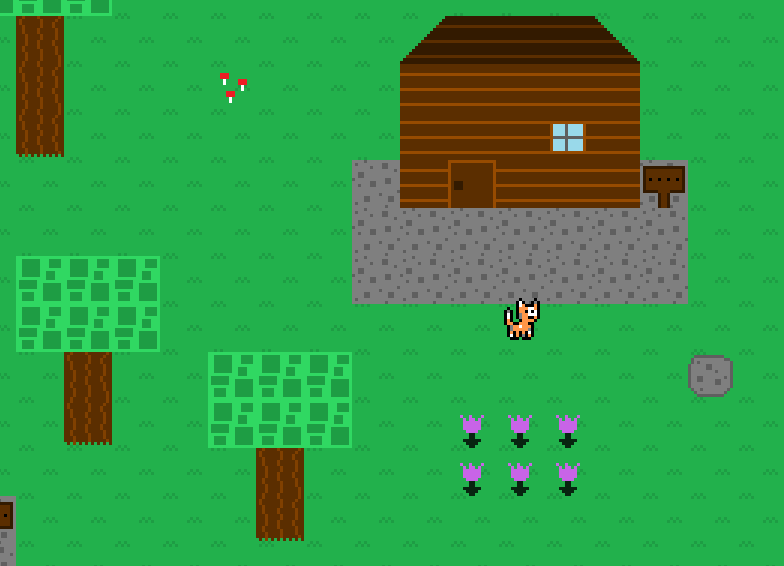
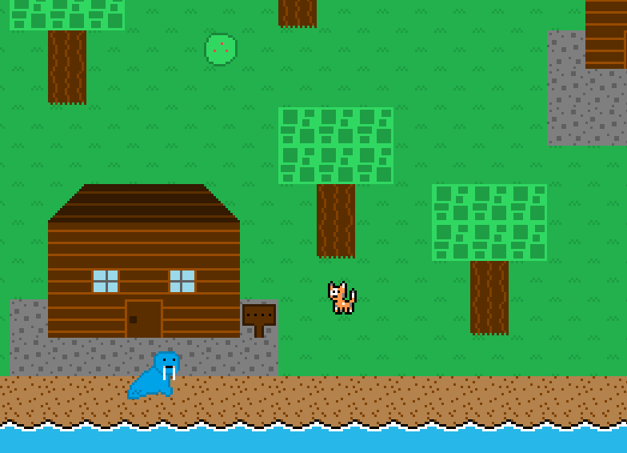

## Table of contents
{: .no_toc .text-delta }

1. TOC
{:toc}

---

# What is this game?

This game (which has no title as of now) is a traditional RPG (role-playing game) where you play as a cat and have to walk around and interact with things in a level
in order to complete certain tasks. At the beginning of the game, the player cat's ball goes missing. The player has to perform
a series of actions in order to find the ball and win the game.

Inspiration for this game came from popular 2D RPG games such as Earthbound and Pokemon. The player currently can walk around and interact with entities as is standard to the genre.1
Story, level, and graphics design were heavily influenced by the games [Earthbound](https://www.youtube.com/watch?v=EIoLcNLyd0g) and [Pokemon Mystery Dungeon](https://www.youtube.com/watch?v=gheGUlKuYmc).

The art direction was intended to create a "happy" vibe, and follows a blocky minimalistic style ~~because I am a horrible artist~~.
The grass is green, the flowers dance, and a bright color palette is used ~~which is totally not just the result of me only using Microsoft Paint default colors~~.

# Features

- One very short level that follows the story of finding the cat's lost ball
- Several entities that can be interacted with
- Player can walk around the level and interact with specific entities
- The level is completed when the cat's ball is found
- Tile map loader that supports both static and animated tiles
- Some interesting level set pieces and the ability to layer tiles to create some interesting effects
- A map editor tool
- A menu and credits screen

The menu screen can be navigated using the arrow keys and an option can be selected with the space bar.

The player character (cat) can walk left, right, up, and down using the arrow keys. The space key is used to tell the player to interact with an entity. 
If you complete the story and find the cat's ball, the level will be completed.

Clearly, this game is not finished -- it's pretty much just the "start" of an RPG. There is one level, a couple of entities that can be interacted with,
and the player can only walk around and interact. There are many different directions the game can be taken in from here,
and the backing game engine was built to support a wide variety of options that could be feasibly implemented.

# Tools used to make this game

This game was written in Java and uses no external libraries. It was developed using the IntelliJ IDE,
although it should work out of the box with any other Java IDEs such as Eclipse. 

All the game's art was created from scratch using the almighty Microsoft Paint.

# Running the game

The game can be run like any other Java application by running the file with the main method to execute the program. I recommend using
the IntelliJ IDE to run the application, however the Eclipse IDE will work fine as well.

The `main` method for the game is in the `Game` package > `Game.java` file.

The `main` method for the map editor is in the `MapEditor` package > `MapEditor.java` file. This is a separate program
from the game.

Java version 8 or later is required to run this game.
To verify your Java version, run the `java -version` command in your CLI.

# Game Screenshots

Here is what the game looks like:

Menu Screen

In Game Screens (the player character is the adorable cat!)

Here's me walking around the map and interacting with things.

